# Hi there, I'm Wallace 👋

---

Software Engineer at **[Profusion](https://profusion.mobi)** with 12+ years of experience across **mobile** (iOS, Android, React Native), **full-stack web** (Next.js, React, TypeScript), and **IoT/embedded systems**. [UNICAMP](https://www.unicamp.br) graduate (B.Sc. in Computer Science). I also happen to enjoy gardening 🌱 and cooking 🍳.

🏆 **RoboCup 2011 Champion** — Won **1st place** at [RoboCup](https://www.robocup.org/), organized by the _RoboCup Federation_.

---

## 🔨 Currently Working On

| Project | Description | Stack |
|---------|-------------|-------|
| **[FAPESP](https://fapesp.br/)** | Equipment sharing platform for São Paulo Research Foundation — heading to **beta launch** | Next.js, Prisma, Oracle Cloud, Auth.js |
| **Freeya** | Cross-platform mobile app with shared business logic | SwiftUI (iOS), Kotlin (Android), GraphQL |
| **Appia Design System** | Component library for AppiaCare | Design tokens, component architecture |

---

## 🛠️ Tech & Tools

**📱 Mobile**

**🌐 Web**

**💻 Languages**

**🖲️ IoT / Hardware**

**⚙️ DevOps & Infrastructure**

---

## 💼 Experience

| | |
|---|---|
| **[Profusion](https://profusion.mobi)** | Software Engineer _(current)_ — building platforms for research institutions & healthcare |
| **Apple App Store** | Published 3 apps independently |
| **UNICAMP** | B.Sc. in Computer Science, University of Campinas |
| **RoboCup 2011** | 1st place — autonomous robotics competition |

---

## 📱 Apps Published on the Apple App Store

| App | Description |
|-----|-------------|
| **Zebec** | Music streaming and discovery app for iOS |
| **LocAlarm** | Location-based alarm app — set alarms triggered by your GPS location |
| **Senolop** | RPN (Reverse Polish Notation) Calculator for iOS |

---

## 🚀 Featured Projects

---

## 🔭 Interests & Side Projects

- 🐢 [Logo (programming language)](https://en.wikipedia.org/wiki/Logo_(programming_language)) · [Logo Foundation](https://el.media.mit.edu/logo-foundation/what_is_logo/logo_programming.html)
- 🧱 [Blocks](https://github.com/ssouzawallace/blocks) — Visual block-based language that generates textual code (Unity3D + Python)
- ⚡ [MadMachine SwiftIO](https://github.com/madmachineio/SwiftIO) — Swift for microcontrollers
- 🐦 [HUMMINGBIRD Projects](https://learn.birdbraintechnologies.com/hummingbirdduo/projects) — Robotics kits & educational hardware

---

## 📊 GitHub Stats

---

## 🐍 Contribution Snake

---

## 🌐 Find Me Online

